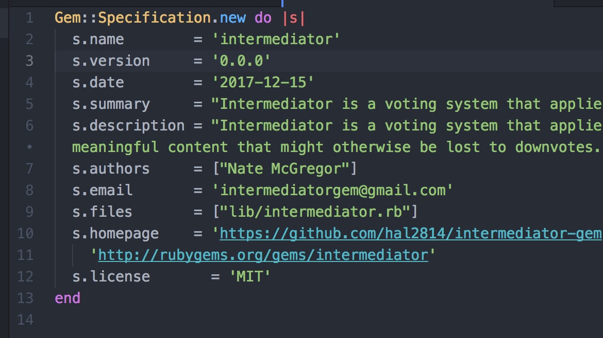
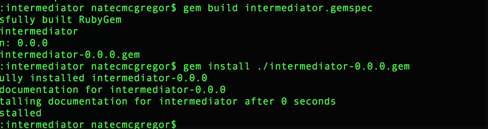
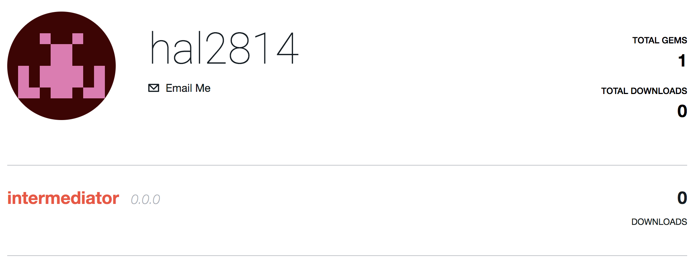

## Post Epicodus Plan

* (high) Find interesting tech companies to apply to, and go through necessary steps to apply and contact them.
* (medium) Research companies (website, clients, Github, Glassdoor)
* (high) Continue work on Ruby Gem project (Egalitarian)
* (medium) Get older projects up an running on Heroku or other hosting platform
* (low) Write at least two recommendations every week on Linkedin for connections I know
* (high) Update Github readmes to look professional at least once per day until they are all done
* (medium) Look for Meetups to go to every week.
* (medium) Check in with class each week, arrange meetings
* (low) Practice Big O notation, recursion, and other logic problems each week.

## Biggest Priorities

* #### Continue work on Ruby Gem project (Egalitarian)
  -_I plan for my capstone project to be a capstone of my early career as a developer, I want to continue to add to this to not only display my passion for programming but also as a personal goal to create a useful open source tool that others may someday use in their own projects._
* #### Update Github readmes to look professional at least once per day until they are all done
  -_I often find that a project does not mean much if someone cannot understand it. I want anyone who looks at highlighted projects in my Github to understand the intent and purpose of a project when looking at it._
* #### Find interesting tech companies to apply to, and go through necessary steps to apply and contact them.
  -_It will be important to discover companies that I would find to be a good fit for me as well as me being a good fit for them. I would like to find developers that have similar interests and goals in programming._

## Action Plan

_To summarize my goals for the coming year to push my career as a developer I will be looking for companies that I feel will be a good mutual fit, I will be researching and discovering as much as possible before and while applying to tech companies. During the week I will be spending time continuing work on my capstone project and updating Github projects and readmes. I will be curating my Linkedin profile to add contacts, write recommendations and connect with peers and professionals in the industry._

## Capstone Project (Egalitarian)
Egalitarian repo can be found here:
https://github.com/hal2814/egalitarian

I had previously named the project "Intermediator", but now im just using it as a test repo for more gem experience here :
https://github.com/hal2814/intermediator-gem

#### Starting capstone checklist
* Research how to build a Ruby Gem, begin by reading guide here: (http://guides.rubygems.org/make-your-own-gem/#introduction)
* follow tutorial for gem creation
* come up with descriptive name for gem that is not taken (Egalitarian)
* Create readme framework to describe the purpose and features of the gem. Create sections to fill in as development of the gem progresses.
* Create Gemspec file

* Create an account with rubygems.org
* Check specification reference
* Test building simple gem then requiring it locally

* successfully register gem with RubyGem.org

* Add language testing for gem, to see where additional require files go in the gemspec

#### About capstone project
_I have chosen the name Egalitarian because it is defined as relating to or believing in the principle that all people are equal and deserve equal rights and opportunities. The Egalitarian gem will make sure meaningful discussions do not get lost in the forum process._
